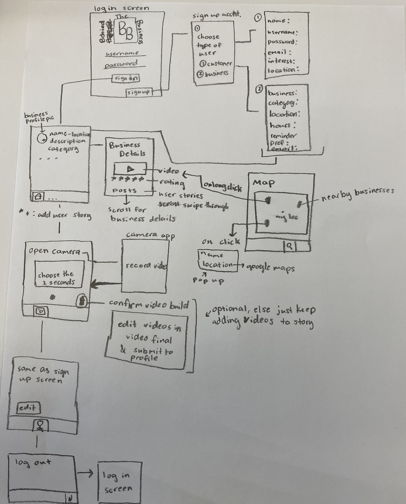

Original App Design Project - README
===

# Top 3 Ideas
1. Tune In - News App
2. What Next - Bullet Journal App
3. Behind The Business - Exclusive Videos to connect Small Businesses with their customers

# Behind the Business

## Table of Contents
1. [Overview](#Overview)
1. [Product Spec](#Product-Spec)
1. [Wireframes](#Wireframes)
2. [Schema](#Schema)

## Overview
### Description
Provides users with the opportunity to form a personal bond with small businesses in their area. Businesses are able to take one second videos and quick photos each day and post to their business acount. Users are then able to view businesses near them, their rating, and what they are currently working on. Videos and pictures can include items that are currently being sold and other information about the business.

### App Evaluation
[Evaluation of your app across the following attributes]
- **Category: Social/Business **
- **Mobile: Uses camera and is meant for android phones. **
- **Story: Allows small businesses to connect with their customers. **
- **Market: Small businesses and any users looking for where to go.**
- **Habit: The user can look through many businesses and businnesses are required to take at least one picture or video every day. **
- **Scope: Can expand to include more information about the business and provide a map with all the locations near you. **

## Product Spec

### 1. User Stories (Required and Optional)

**Required Must-have Stories**

* login to your account or create either a business or individual account
* inclue a home feed that includes businesses near you from an api and is geared towards your interests
* business details page with a compilation video of their two seconds a day if they use the app, with social media, rating, hours of operation, location, and individual stories
* individual users can post a pictyre and submit a rating for a business that they went to
* uploading videos every day to create a compilation video
* map with the closest businesses to you for users
* profile page with business details that can be edited
* profile page with individual's interests that can be edited

**Optional Nice-to-have Stories**

* Clicking on profile picture includes hearted images
* Clicking on video opens full screen
* Links to the businesses social media and link to the businesses website
* Place an order link
* Favorite A Business, so it shows up on Individuals Profile Page
* Smoother transitions for creating business videos
* Allowing businesses to edit the auto created combined video
* Allowing individuals to post video reviews as well as pictures
* Push notifications when it is time to upload
* Search bar to search for a certain category (ex. food, clothing, etc)
* making individual's picture double sided so that one side is a selfie of yourself and the other is of the business
* follow your friends to see where they have recently been

### 2. Screen Archetypes

* [Login Page]
    * allow users to signup as an idividual or business user
* [Business Feed]
    * allow users to look through businesses that match their interests
   * [Business Details Activity]
       * allow users to look through the business details such as rating hours of operation, location, and social media accounts. Also play a video of the business and allow users to look through other individuals posts about the business
   * [Compose Individual Story (only individual users)] 
       * allow individual users to rate the business and post a picture at the business
* [Video Creation (only businesses users)]
    * allow business users to record and choose a two second video clip of the products they sell or the store that gets added to their business video
* [Profile]
    * displays the current users information and allows for users to edit their information
* [Search Page]
    * [Map]
    * allow users to look for businesses near them

### 3. Navigation

**Tab Navigation** (Tab to Screen)

Bottom Navigation
* [Profile]
* [Business Feed]
* [Logout]
* [Compose Video for Businesses]
* [Search Bar]

**Flow Navigation** (Screen to Screen)

* [Login]
   * [Create account as User or Business]
* [Business Feed]
   * [Business Details]
   * [Individual Story Add]
* [Video Creation]
* [Profile]
* [Search Bar]
   * [Map with location and other nearbye stores]
       * [Click on location and go to Business Details]   
* [Logout]
    * [Login] 

## Wireframes

### [BONUS] Digital Wireframes & Mockups

https://www.figma.com/file/MCLMLxCI0CXiMtyAhqidaq/BB-App-Wireframing?node-id=3%3A9

### [BONUS] Interactive Prototype

## Schema 
[This section will be completed in Unit 9]
### Models
Individual User
| Property         | Type   | Description                                           |
| ---------------- | ------ | ----------------------------------------------------- |
| Name             | String | Full name of the user                                 |
| Username         | String | Username used to login                                |
| Password         | String | Pasword used to login                                 |
| Top 3 Categories | String | Top 3 Business Categories such as food, clothing, etc |

Business User
| Property           | Type    | Description                                               |
| ------------------ | ------- | --------------------------------------------------------- |
| Business Name      | String  | Full name of the user                                     |
| Username           | String  | Username used to login                                    |
| Password           | String  | Pasword used to login                                     |
| Description        | String  | Quick summary about the business                          |
| Hours of Operation | String  | When the Business is open                                 |
| Social Media       | String  | Business instagram and/or facebook account                |
| Rating             | Number  | Rating of the business out of 5                           |
| Category           | String  | What is the type of business (Food, Travel, Clothes)      |
| Location           | String  | Where is the business located                             |
| Online             | Boolean | Is the business fully online or is there a physical store |
| Profile Pic        | File    | Image of the business logo                                |

Individual Story Post
| Property   | Type    | Description                                         |
| ---------- | ------- | --------------------------------------------------- |
| User       | Pointer | Points to the individual user who made the post     |
| Image      | File    | Picture taken at the store of                       |
| Rating     | Number  | Store the given Rating by the customer              |
| Likes      | Number  | The number of likes for a given post                |
| UsersLikes | Array   | Includes users who liked the post                   |
| Business   | Pointer | Points to the business that the post was made about |

Business Daily Videos
| Property   | Type    | Description                                     |
| ---------- | ------- | ----------------------------------------------- |
| User       | Pointer | Point to the business user who took the video   |
| Created At | Date    | Includes when the video was taken               |
| Video      | File    | Two second video that was taken                 |
| Video Type | String  | Was the video of the store, products, or people |

### Networking
Home Feed

- (Read/GET) Query all business users (name, description, and profile pic) in the same category as the individual user's top 3 categories or the business user's category

Compose User Story

- (Create/POST) Take a picture for a chosen business
- (Create/POST) Provide a rating for a chosen business
 
Business Details 

- (Read/GET) Query all videos taken by the chosen business
- (Read/GET) Query chosen business's user details
- (Read/GET) Query all individual posts made about the chosen business
- (Create/POST) Like a user story
- (Delete) Unlike a user story
    
Daily Videos

- (Create/POST) Create a new two second video

Profile

- (Update/PUT) Edit user details such as location, interests, hours of operation, etc
- (Read/GET) Query logged in user object

Search

- (Read/GET) Query businesses within a 15 mile radius of the current user's location

- [OPTIONAL: List endpoints if using existing API such as Yelp]
